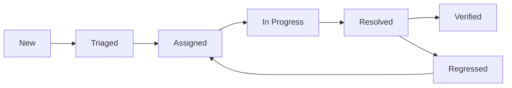

# 📜 AgendaIQ Sentry Monitoring Policy
**Version:** 1.0  
**Effective Date:** 2025-01-10  
**Classification:** Internal  
**Owner:** DevOps Team

---

## 1. 📋 AMAÇ VE KAPSAM

### 1.1 Amaç
Bu politika, AgendaIQ platformunda Sentry error monitoring ve performance tracking sisteminin kullanım standartlarını, sorumlulukları ve prosedürlerini tanımlar.

### 1.2 Kapsam
- Tüm production ve development ortamları
- Frontend (web) ve backend (api) servisleri
- Mobile uygulamalar (gelecekte)
- Batch jobs ve background workers

### 1.3 Hedefler
- **MTTA (Mean Time to Acknowledge)**: < 10 dakika
- **MTTR (Mean Time to Resolve)**: < 2 saat
- **Crash-free users**: > %99.5
- **Error rate**: < %0.2

---

## 2. 🔐 GÜVENLİK VE GİZLİLİK

### 2.1 Veri Sınıflandırması

#### ❌ ASLA Sentry'ye Gönderilmeyecek Veriler
- Kullanıcı şifreleri
- API key ve tokenlar
- Kredi kartı bilgileri
- TC Kimlik numaraları
- IBAN numaraları
- Email adresleri (hash'lenmemiş)
- Telefon numaraları
- Çerez (cookie) değerleri
- Session ID'leri
- OAuth token'ları

#### ✅ Güvenli Olarak Gönderilebilecek Veriler
- Hash'lenmiş user ID
- Rol ve yetki bilgileri
- Okul/Bölge ID'leri (tenant_id)
- Tarayıcı ve cihaz bilgileri
- URL path'leri (query string hariç)
- Timestamp ve timezone
- Error stack trace
- Performance metrics

### 2.2 Veri Maskeleme Kuralları

```typescript
// Zorunlu maskeleme patterns
const SENSITIVE_PATTERNS = {
  email: /([a-zA-Z0-9._-]+@[a-zA-Z0-9._-]+\.[a-zA-Z0-9_-]+)/gi,
  phone: /(\+?[0-9]{1,3}[-.\s]?\(?[0-9]{1,3}\)?[-.\s]?[0-9]{3,4}[-.\s]?[0-9]{4})/gi,
  tcno: /\b[1-9][0-9]{10}\b/g,
  iban: /[A-Z]{2}[0-9]{2}[A-Z0-9]{4}[0-9]{7}([A-Z0-9]?){0,16}/gi,
  creditCard: /\b(?:\d[ -]*?){13,16}\b/g,
  apiKey: /(api[_-]?key|apikey)([\'\"\\s:=]+)([a-zA-Z0-9_-]{20,})/gi,
  token: /(token|bearer|jwt)([\'\"\\s:=]+)([a-zA-Z0-9_-]{20,})/gi
};
```

### 2.3 GDPR/KVKK Uyumluluğu
- **Data Retention**: Maximum 30 gün
- **User Consent**: Error tracking için explicit consent gerekmez
- **Right to Erasure**: User request üzerine 72 saat içinde data silme
- **Data Portability**: User data export API kullanılabilir

---

## 3. 🌍 ENVIRONMENT STANDARTLARI

### 3.1 Environment Tanımları

| Environment | DSN | Purpose | Sampling | Alerts |
|------------|-----|---------|----------|---------|
| **development** | Ayrı DSN | Local development | High | Disabled |
| **staging** | Ayrı DSN | Pre-production test | Medium | Test only |
| **production** | Production DSN | Live system | Optimized | Enabled |

### 3.2 Environment Konfigürasyonu

#### Development
```yaml
environment: development
debug: true
sampleRate: 1.0  # %100 errors
tracesSampleRate: 0.3  # %30 traces
replaysOnErrorSampleRate: 0  # No replays
replaysSessionSampleRate: 0  # No session replays
beforeSend: minimal filtering
alerts: disabled
```

#### Staging
```yaml
environment: staging
debug: false
sampleRate: 1.0  # %100 errors
tracesSampleRate: 0.2  # %20 traces
replaysOnErrorSampleRate: 0.1  # %10 error replays
replaysSessionSampleRate: 0  # No session replays
beforeSend: full filtering
alerts: test channels only
```

#### Production
```yaml
environment: production
debug: false
sampleRate: 1.0  # %100 errors
tracesSampleRate: 0.1  # %10 traces (dynamic)
replaysOnErrorSampleRate: 0.05  # %5 error replays
replaysSessionSampleRate: 0.001  # %0.1 session replays
beforeSend: strict filtering
alerts: all channels enabled
```

---

## 4. 📛 RELEASE VE VERSIONING

### 4.1 Release Naming Convention
```
Format: {company}@{service}@{version}+{commit_sha}
Example: agendaiq@web@1.2.3+abc1234
```

### 4.2 Semantic Versioning
- **Major**: Breaking changes (1.0.0 → 2.0.0)
- **Minor**: New features (1.0.0 → 1.1.0)
- **Patch**: Bug fixes (1.0.0 → 1.0.1)

### 4.3 Release Requirements
- [ ] Sourcemaps uploaded
- [ ] Release notes documented
- [ ] Deploy marker sent
- [ ] Previous release tagged
- [ ] Rollback plan ready

---

## 5. 🏷️ TAGGING VE METADATA

### 5.1 Zorunlu Tag'ler
Tüm event'lerde bulunması gereken tag'ler:

| Tag | Description | Example |
|-----|-------------|---------|
| `service` | Service identifier | `web`, `api`, `worker` |
| `environment` | Environment name | `production` |
| `release` | Release identifier | `agendaiq@web@1.2.3+abc1234` |
| `region` | Deployment region | `eu-west-1` |
| `tenant_id` | School/District ID | `school_123` |
| `user_role` | User role | `administrator`, `teacher` |

### 5.2 Opsiyonel Tag'ler
İhtiyaca göre eklenebilecek tag'ler:

| Tag | Description | Example |
|-----|-------------|---------|
| `feature_flag` | Active feature flags | `new_ui:enabled` |
| `experiment` | A/B test variant | `checkout_v2:variant_a` |
| `api_version` | API version | `v2` |
| `client_version` | Client app version | `1.2.3` |
| `school_type` | School classification | `public`, `private` |

---

## 6. 🚨 ALERT VE INCIDENT RESPONSE

### 6.1 Severity Levels

#### SEV1 - Critical Outage
**Definition**: Core functionality completely broken  
**Examples**: 
- Login system down
- Database unreachable
- Payment processing failed
- Crash rate > %5

**Response**:
- Acknowledge: < 5 minutes
- First response: < 15 minutes
- Resolution: < 1 hour
- Notification: PagerDuty + Phone + Slack + Email

#### SEV2 - Major Degradation
**Definition**: Significant functionality impaired  
**Examples**:
- Error rate > %1
- p95 latency > 2x baseline
- New critical bug affecting > 10 users
- Feature partially broken

**Response**:
- Acknowledge: < 15 minutes
- First response: < 30 minutes
- Resolution: < 4 hours
- Notification: Slack + Email

#### SEV3 - Minor Issue
**Definition**: Non-critical functionality affected  
**Examples**:
- UI glitch
- Non-blocking error
- Performance degradation < 20%
- Single user issue

**Response**:
- Acknowledge: < 1 hour
- First response: < 4 hours
- Resolution: < 24 hours
- Notification: Slack only

### 6.2 Alert Rules

#### Error-Based Alerts
```yaml
new_critical_issue:
  condition: level:error AND count_unique(user) >= 10 in 10min
  action: Create SEV2 incident
  
error_rate_spike:
  condition: error_rate > 1% for 15min
  action: Create SEV2 incident
  
regression:
  condition: resolved issue reopened
  action: Create SEV3 incident + Auto-assign
```

#### Performance Alerts
```yaml
latency_degradation:
  condition: p95(duration) > 1000ms for critical endpoints
  action: Create SEV3 incident
  
throughput_drop:
  condition: RPS decrease > 50% for 5min
  action: Create SEV2 incident
```

#### Crash Alerts
```yaml
crash_rate_high:
  condition: crash_free_users < 99%
  action: Create SEV2 incident
  
crash_spike:
  condition: crash_rate increase > 200% in 30min
  action: Create SEV1 incident
```

### 6.3 Escalation Matrix

| Time | SEV1 | SEV2 | SEV3 |
|------|------|------|------|
| 0-5 min | On-call Engineer | - | - |
| 5-15 min | Team Lead | On-call Engineer | - |
| 15-30 min | Engineering Manager | Team Lead | On-call Engineer |
| 30-60 min | CTO | Engineering Manager | Team Lead |
| 60+ min | CEO | CTO | Engineering Manager |

---

## 7. 📊 MONITORING DASHBOARDS

### 7.1 Dashboard Types

#### Executive Dashboard
**Audience**: Management, Product  
**Refresh**: 5 minutes  
**Metrics**:
- Crash-free users/sessions
- Error rate trend
- Release health
- User impact summary
- SLO compliance

#### Operational Dashboard
**Audience**: DevOps, Engineering  
**Refresh**: 1 minute  
**Metrics**:
- Real-time error stream
- Alert status
- Service health
- Infrastructure metrics
- Active incidents

#### Triage Dashboard
**Audience**: On-call, Support  
**Refresh**: Real-time  
**Metrics**:
- New/Unresolved issues
- Issue assignment status
- Error details
- Stack traces
- User impact

### 7.2 Key Metrics

| Metric | Good | Warning | Critical |
|--------|------|---------|----------|
| Crash-free users | > 99.5% | 99-99.5% | < 99% |
| Error rate | < 0.2% | 0.2-0.5% | > 0.5% |
| p95 latency | < 500ms | 500-1000ms | > 1000ms |
| p99 latency | < 1500ms | 1500-2000ms | > 2000ms |
| Apdex score | > 0.9 | 0.7-0.9 | < 0.7 |

---

## 8. 🔄 ISSUE MANAGEMENT

### 8.1 Issue Lifecycle



### 8.2 Triage Process

#### Daily Triage (09:00 AM)
1. Review all new issues from last 24h
2. Assign severity and priority
3. Assign to appropriate team/person
4. Link related issues
5. Add reproduction steps if available

#### Weekly Review (Monday 14:00)
1. Review unresolved issues
2. Re-prioritize based on impact
3. Archive/mute non-actionable issues
4. Update runbooks for recurring issues
5. Analyze trends and patterns

### 8.3 Issue Assignment Rules

| Issue Type | Auto-Assign To | Backup |
|------------|---------------|--------|
| Frontend Error | Frontend Team | Team Lead |
| API Error | Backend Team | Team Lead |
| Database Error | DevOps Team | Backend Team |
| Auth Error | Security Team | Backend Team |
| Performance | Performance Team | DevOps |
| Mobile | Mobile Team | Frontend Team |

---

## 9. 🚀 DEPLOYMENT REQUIREMENTS

### 9.1 Pre-Deployment Checklist
- [ ] All tests passing
- [ ] No unresolved SEV1/SEV2 issues
- [ ] Sourcemaps generated
- [ ] Release notes prepared
- [ ] Rollback plan documented
- [ ] Alert rules updated (if needed)

### 9.2 Deployment Process
1. Create release in Sentry
2. Upload sourcemaps
3. Deploy to staging
4. Monitor for 30 minutes
5. Deploy to production (canary)
6. Monitor for 1 hour
7. Full production rollout
8. Send deploy marker
9. Monitor for 24 hours

### 9.3 Rollback Criteria
Automatic rollback if any:
- Crash rate increases > 100%
- Error rate > 2%
- p95 latency > 2x baseline
- Critical feature failure
- SEV1 incident created

---

## 10. 📈 PERFORMANCE BUDGET

### 10.1 Frontend Performance
| Metric | Budget | Measurement |
|--------|--------|-------------|
| LCP | < 2.5s | p75 |
| INP | < 200ms | p75 |
| CLS | < 0.1 | p75 |
| FCP | < 1.8s | p75 |
| TTFB | < 800ms | p75 |
| Bundle size | < 500KB | Gzipped |

### 10.2 Backend Performance
| Endpoint | p50 | p95 | p99 |
|----------|-----|-----|-----|
| `/api/auth/*` | < 100ms | < 300ms | < 500ms |
| `/api/meetings/*` | < 200ms | < 500ms | < 1000ms |
| `/api/staff/*` | < 150ms | < 400ms | < 800ms |
| `/api/reports/*` | < 500ms | < 1500ms | < 3000ms |

---

## 11. 🎓 TRAINING VE DOCUMENTATION

### 11.1 Zorunlu Eğitimler
| Role | Training | Frequency |
|------|----------|-----------|
| All Developers | Sentry Basics | Onboarding |
| Senior Developers | Advanced Debugging | Quarterly |
| DevOps | Alert Management | Bi-annual |
| On-call | Incident Response | Monthly |
| Team Leads | Dashboard Analytics | Quarterly |

### 11.2 Dokümantasyon Gereksinimleri
- Runbook for each critical path
- Alert response playbook
- Common issues troubleshooting guide
- Integration setup guide
- Best practices document

---

## 12. 📏 COMPLIANCE VE AUDIT

### 12.1 Audit Schedule
- **Weekly**: Alert accuracy review
- **Monthly**: SLO compliance check
- **Quarterly**: Policy compliance audit
- **Annually**: Full security audit

### 12.2 Compliance Metrics
| Metric | Target | Measurement |
|--------|--------|-------------|
| Policy compliance | > 95% | Monthly audit |
| Alert accuracy | > 90% | Weekly review |
| MTTA achievement | > 80% | Daily tracking |
| MTTR achievement | > 80% | Daily tracking |
| Data masking effectiveness | 100% | Quarterly audit |

---

## 13. 🔧 MAINTENANCE

### 13.1 Regular Maintenance Tasks
| Task | Frequency | Owner |
|------|-----------|-------|
| Clear muted issues | Weekly | DevOps |
| Update ignore patterns | Bi-weekly | Dev Team |
| Review alert thresholds | Monthly | DevOps |
| Archive old issues | Monthly | Team Leads |
| Update dashboards | Quarterly | Product |
| Review sampling rates | Quarterly | DevOps |

### 13.2 Upgrade Schedule
- **SDK Updates**: Monthly (patch), Quarterly (minor)
- **Integration Updates**: Quarterly
- **Dashboard Updates**: As needed
- **Alert Rule Updates**: Monthly review

---

## 14. 💰 BUDGET VE COST MANAGEMENT

### 14.1 Usage Limits
| Resource | Soft Limit | Hard Limit | Action |
|----------|------------|------------|--------|
| Errors/month | 1M | 2M | Review filtering |
| Transactions/month | 500K | 1M | Reduce sampling |
| Replays/month | 10K | 20K | Lower replay rate |
| Attachments/month | 100GB | 200GB | Disable attachments |

### 14.2 Cost Optimization
- Review usage weekly
- Adjust sampling monthly
- Archive old data quarterly
- Negotiate pricing annually

---

## 15. 📞 CONTACT VE SUPPORT

### Internal Contacts
- **DevOps Team**: devops@agendaiq.com
- **On-call**: +90 XXX XXX XXXX
- **Escalation**: escalation@agendaiq.com

### External Support
- **Sentry Support**: support@sentry.io
- **Account Manager**: [Contact Name]
- **Technical Account Manager**: [Contact Name]

---

## 16. 📝 APPENDICES

### Appendix A: Glossary
- **MTTA**: Mean Time to Acknowledge
- **MTTR**: Mean Time to Resolve
- **SLO**: Service Level Objective
- **SLA**: Service Level Agreement
- **LCP**: Largest Contentful Paint
- **INP**: Interaction to Next Paint
- **CLS**: Cumulative Layout Shift

### Appendix B: References
- [Sentry Documentation](https://docs.sentry.io)
- [Web Vitals Guide](https://web.dev/vitals)
- [OWASP Security Guidelines](https://owasp.org)

### Appendix C: Change Log
| Version | Date | Changes | Author |
|---------|------|---------|--------|
| 1.0 | 2025-01-10 | Initial policy | DevOps Team |

---

## 17. ✅ APPROVAL

| Role | Name | Signature | Date |
|------|------|-----------|------|
| CTO | [Name] | _________ | _____ |
| Engineering Manager | [Name] | _________ | _____ |
| DevOps Lead | [Name] | _________ | _____ |
| Security Officer | [Name] | _________ | _____ |

---

**Next Review Date**: 2025-04-10  
**Policy Owner**: DevOps Team  
**Distribution**: All Engineering Staff

---

*This policy is classified as Internal and should not be shared outside the organization without proper authorization.*